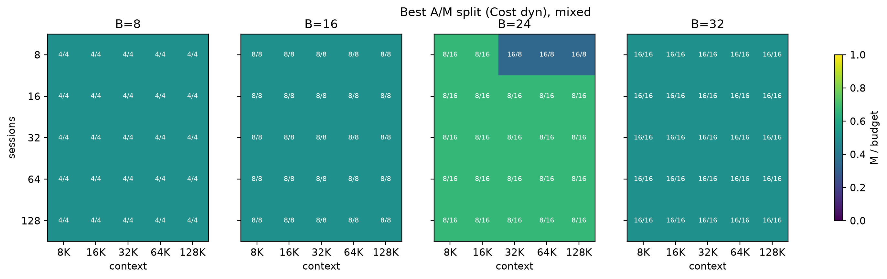
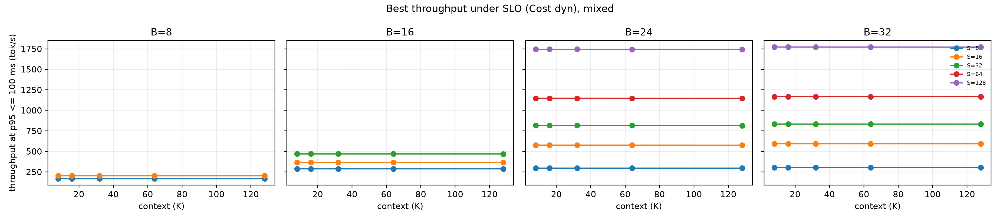
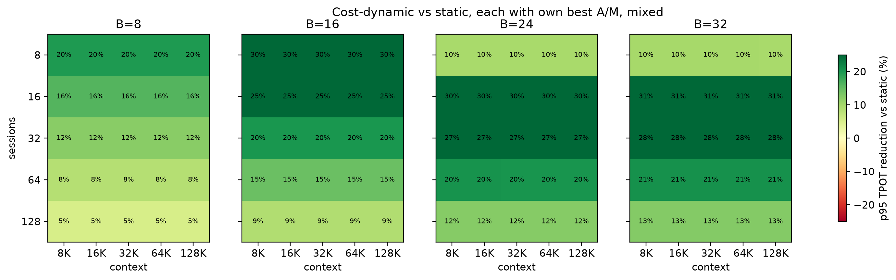
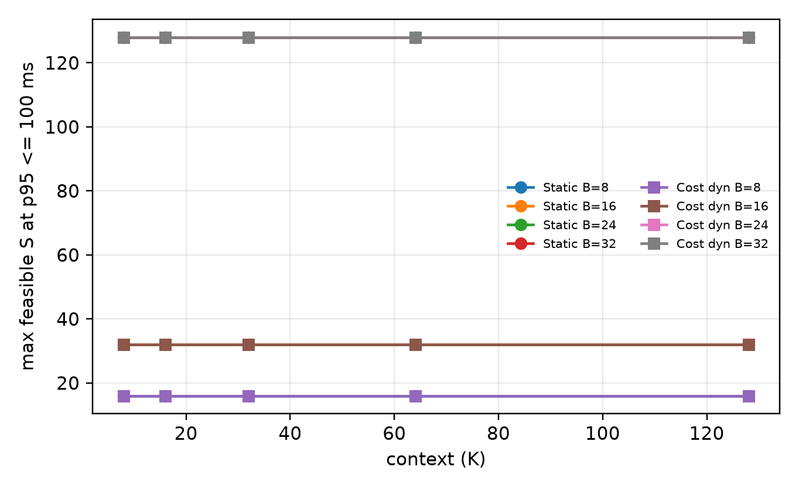

# FlexEP: Capacity-Enabled Dynamic Expert Parallelism for Heterogeneous HBM--HBF MoE Inference

## Abstract

Large MoE inference stresses two different resources: attention needs high-bandwidth execution and per-session KV capacity, while MoE layers need enough memory capacity to hold a very large expert set. We study **FlexEP**, a heterogeneous serving architecture that keeps attention and dense layers on HBM GPUs while moving MoE execution to high-capacity HBF devices. In our model, HBM and HBF have the same read bandwidth; HBF is useful because capacity allows every MoE worker to store a complete expert replica. This removes fixed expert ownership and turns expert parallelism into a per-microbatch scheduling problem.

FlexEP does **not** rely on expert pruning. For every microbatch and MoE layer, it uses the model's natural selected experts, estimates each active expert's fetch-plus-compute cost, and dynamically assigns whole-expert jobs across replicated HBF MoE workers. In a no-pruning R1-AWQ trace-backed Vidur replay using DeepSeek-V3-shaped MoE geometry, FlexEP reduces mean p95 TPOT by 12.3--20.3% and improves mean throughput by 14.5--26.8% over static expert ownership at equal GPU budgets. The strongest current claim is therefore narrow but genuine: HBF capacity enables full expert replication, and full replication enables cost-aware dynamic expert parallelism that consistently improves no-pruning serving behavior over static EP.

## 1. Introduction

Modern MoE inference is not only a compute problem. Attention and dense layers consume HBM bandwidth and maintain KV state for every active sequence, while MoE layers repeatedly access a large routed-expert collection. Conventional expert parallelism shards experts across devices, which saves memory but creates a placement constraint: if an expert is owned by a fixed GPU, routing imbalance becomes execution imbalance.

FlexEP targets the opposite design point. It disaggregates attention from MoE execution and gives the MoE side enough HBF capacity to replicate the full expert set on every MoE worker. Since HBM and HBF bandwidth are modeled equally, FlexEP is not a hot-expert caching proposal. Its advantage comes from capacity: when every MoE worker can execute any expert, the scheduler can assign the active expert jobs differently for every microbatch and layer.

The core claim is:

> FlexEP is a heterogeneous multi-node system that disaggregates LLM attention and MoE execution, retaining HBM GPUs for attention while replacing capacity-constrained HBM MoE nodes with high-capacity HBF accelerators whose full expert replication enables dynamic expert parallelism to balance expert-fetch and compute load across MoE GPUs at each microbatch.

This draft makes three contributions:

1. A heterogeneous HBM-attention/HBF-MoE architecture where HBF capacity enables complete expert replication.
2. A per-microbatch dynamic EP scheduler that balances expert fetch and compute cost without migrating weights.
3. A trace-backed Vidur evaluation path that optimizes the attention/MoE GPU split under fixed total GPU budgets and an SLO target.

## 2. Design

For a total budget `G=A+M`, FlexEP uses `A` HBM GPUs for attention and dense execution and `M` HBF devices for MoE execution. The HBF devices are replicated MoE workers: each stores the full routed-expert collection. Expert weights are not moved between devices at runtime, and HBM is not used to hold hot experts. The runtime only changes token dispatch metadata.

FlexEP executes MoE per microbatch. For every microbatch and MoE layer, the router's selected experts are left unchanged. Each active expert becomes one scheduling job:

```text
cost(expert) = expert_fetch_time + routed_tokens(expert) * expert_compute_time
```

The fetch term captures reading that expert's weights from local HBF. The compute term captures the expert GEMM work for the routed tokens. These terms are not assumed equal. A cost-aware scheduler assigns whole active-expert jobs to MoE GPUs to reduce the slowest MoE worker in that microbatch/layer. Static EP, by contrast, uses fixed expert ownership.

The current evaluation fixes `microbatch_count = 2`. This is a practical midpoint: it exposes overlap between the attention and MoE pools while avoiding the repeated weight-read overhead that grows with too many microbatches. In steady-state decode, the idealized bound is:

```text
TPOT(A,M) ~= max(T_attention(A), T_MoE(M))
```

For each fixed total budget, FlexEP searches legal `A:M` splits. Among splits that satisfy the p95 TPOT SLO, it chooses the highest-throughput configuration; if no split satisfies the SLO, it reports the lowest-p95 split.

## 3. Evaluation

### 3.1 Methodology

The current result is a **no-pruning R1 trace-backed Vidur replay**, not a hardware measurement and not a final DeepSeek-V3 trace result. The R1-AWQ traces provide selected expert IDs only, so they are used as DeepSeek-V3-shaped routing/load traces: 256 routed experts, top-8 routing, and 58 MoE layers. Because the traces do not include router weights, this evaluation does not measure router-weight, perplexity, or quality tradeoffs.

Vidur remains the outer serving simulator. It models request arrivals, decode batching, request-level metrics, throughput, and p95 TPOT. FlexEP replaces Vidur's uniform/worst-case MoE routing estimate with a trace-backed MoE service-time path. For each Vidur decode batch, the evaluator maps requests to held-out R1 routes, reads the current decode step, computes MoE-layer costs under static or dynamic assignment, and returns the resulting MoE service time to Vidur.

We sweep:

- GPU budgets: `G = 8, 16, 24, 32`
- Context lengths: `8K, 16K, 32K, 64K, 128K`
- Concurrent sessions: `S = 8, 16, 32, 64, 128`
- Microbatch count: `2`
- Policies: static expert ownership and cost-aware dynamic EP
- SLO: p95 TPOT <= 100 ms

All 450 detailed runs completed successfully.

### 3.2 Best attention/MoE split



*Figure 1. Best attention/MoE split selected by cost-aware dynamic EP under fixed total GPU budgets. `A` is the HBM attention pool and `M` is the HBF MoE pool.*

The optimizer consistently chooses balanced splits at 8, 16, and 32 GPUs: `A=4,M=4`, `A=8,M=8`, and `A=16,M=16`. At 24 GPUs it chooses `A=8,M=16` in 22 of 25 context/workload cells, switching to `A=16,M=8` only in three low-session cells. This is a useful result: when the workload grows, the replicated MoE pool benefits from more HBF workers, but the attention pool still needs enough HBM GPUs to avoid becoming the exposed stage after MoE balancing.

### 3.3 Throughput under a p95 TPOT SLO



*Figure 2. Throughput of the best cost-aware dynamic EP split under a 100 ms p95 TPOT target. If no split satisfies the target, the plotted point is the lowest-p95 split.*

Dynamic EP increases throughput as sessions rise because more requests are served concurrently, but the p95 SLO limits which session counts are feasible at each GPU budget. With 8 GPUs, the largest feasible swept workload is 16 sessions. With 16 GPUs, it is 32 sessions. With 24 or 32 GPUs, all swept workloads through 128 sessions meet the 100 ms target.

The 100 ms SLO tiers are the same for static and dynamic EP in this coarse session sweep. That does not mean dynamic EP has no value; it means the tested session grid jumps from 32 to 64 and from 64 to 128. Within each fixed budget/session/context cell, dynamic EP still lowers p95 TPOT and raises throughput.

### 3.4 Dynamic EP versus static EP



*Figure 3. Cost-aware dynamic EP compared with static expert ownership at the same total GPU budget, context length, session count, and microbatch count. No pruning is used.*

Across all matched cells, cost-aware dynamic EP consistently improves serving behavior:

| GPU budget | Best dynamic split pattern | Mean p95 TPOT reduction vs static | Mean throughput gain vs static |
|---:|---|---:|---:|
| 8 | `A=4, M=4` | 12.3% | 14.5% |
| 16 | `A=8, M=8` | 19.8% | 25.8% |
| 24 | mostly `A=8, M=16` | 20.0% | 26.3% |
| 32 | `A=16, M=16` | 20.3% | 26.8% |

At 128K context, representative p95 TPOT and throughput are:

| Budget | Sessions | Static p95 TPOT | Dynamic p95 TPOT | Static throughput | Dynamic throughput |
|---:|---:|---:|---:|---:|---:|
| 8 | 16 | 93.35 ms | 78.38 ms | 171.4 tok/s | 204.1 tok/s |
| 16 | 32 | 85.27 ms | 68.15 ms | 375.3 tok/s | 469.6 tok/s |
| 24 | 128 | 83.92 ms | 73.48 ms | 1525.3 tok/s | 1741.9 tok/s |
| 32 | 128 | 82.73 ms | 72.29 ms | 1547.2 tok/s | 1770.6 tok/s |

This is the cleanest current evidence for FlexEP. The comparison is no-pruning, trace-backed, and budget-matched. The only changed mechanism is dynamic expert assignment enabled by full expert replication.

### 3.5 Maximum feasible sessions



*Figure 4. Maximum swept session count that satisfies p95 TPOT <= 100 ms for each GPU budget and context length.*

The maximum feasible swept session count is stable across context length in this decode-only configuration: 16 sessions at 8 GPUs, 32 sessions at 16 GPUs, and 128 sessions at 24 or 32 GPUs. This stability should be interpreted carefully. It means the present Vidur configuration is not exposing strong context-length sensitivity in TPOT. Therefore, these results should not be used to claim that FlexEP has solved long-context attention bottlenecks. The valid claim is narrower: under the modeled decode workload, no-pruning dynamic EP improves p95 TPOT and throughput over static EP at fixed GPU budget.

## 4. Limitations

This draft intentionally removes expert dropping from the core story. That makes the claim cleaner, but it also narrows what the current results prove.

First, the routing traces are R1-AWQ traces used as DeepSeek-V3-shaped selected-expert traces. They are not true DeepSeek-V3 traces. Second, the traces contain selected expert IDs but not router weights, so this evaluation cannot measure quality or perplexity. Third, Vidur is still a simulator; it models serving behavior but not implementation overheads such as scheduler latency, token dispatch kernel overhead, or real network contention. Fourth, context length has little effect in the current decode-only sweep, so long-context claims require a separate experiment that stresses attention/KV behavior more directly. Fifth, broader architecture comparisons against all-HBM and all-HBF colocated systems should be rerun in the same no-pruning, trace-backed framework before making final end-to-end superiority claims.

## 5. Conclusion

FlexEP's strongest current path is not pruning. It is HBF-capacity-enabled dynamic expert parallelism. If every HBF MoE worker stores every expert, then expert placement no longer constrains execution. That lets the runtime rebalance natural router-selected expert work at every microbatch and MoE layer. In the no-pruning trace-backed Vidur sweep, this produces consistent improvements over static expert ownership: 12.3--20.3% lower mean p95 TPOT and 14.5--26.8% higher mean throughput at matched GPU budgets.

The next paper step is to strengthen this no-pruning result: collect or obtain closer DeepSeek-V3 traces, rerun all baselines in the same trace-backed Vidur path, add implementation-overhead sensitivity, and then decide whether FlexEP's claim should be framed as latency reduction, throughput increase, or fewer HBF MoE GPUs for the same SLO.
